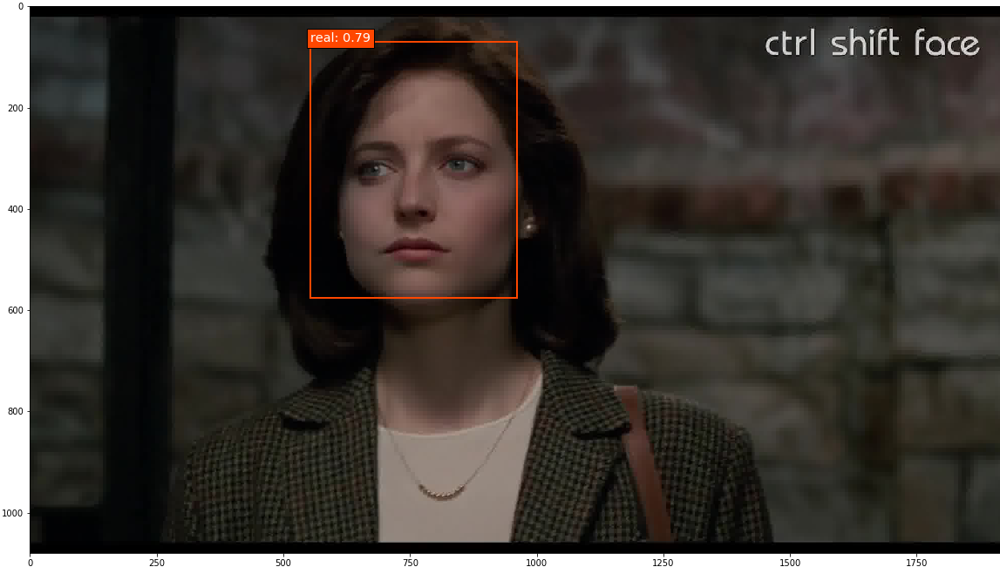
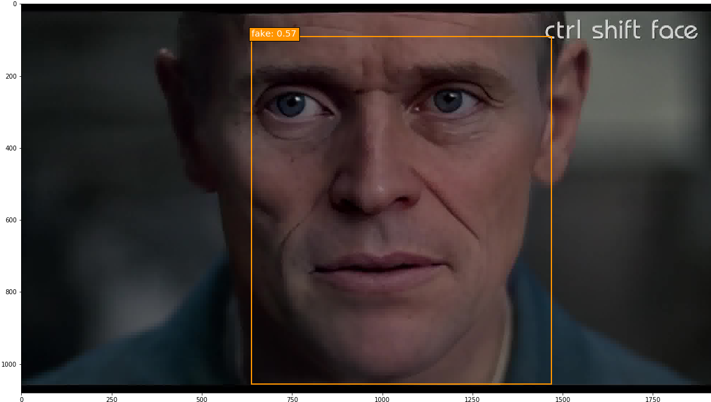

# Summary
Deepfakes are synthetic videos created using deep learning techniques, where an individual’s face is inserted into an existing video, and they can be made to appear as if they performed actions that occurred in the original video. Some deepfakes circulating on the internet now are very difficult to identify as manipulated media, and present a serious risk for the spread of deceitful content. In an age where communication technologies inundate us with an abundance of information daily, determining what material is veritable and what is fabricated is a responsibility we all share.

I took on this project with the goal of identifying tools for detecting deepfake videos. To do so, I manually annotated 300 minutes of video (totaling 449,977 frames) for real/fake faces using the Clay Sciences video annotation platform. These annotations were used to train a Single Shot MultiBox Detector (SSD) model with Keras and TensorFlow on Google Cloud Platform. Results demonstrate that the trained model is particularly adept at predicting fake faces. Specifically, when the model is very confident about its prediction of a face as fake, it is virtually 100% accurate. Some examples of the trained model's output are below. In these examples, I fed the model frames extracted from existing deepfake videos and had it predict which faces were real or fake.

<figure>
  
  
    <figcaption>**Tom Holland and Robert Downey Jr. inserted into *Back to the Future***</figcaption>
</figure>

&nbsp;

<figure>
  
    <figcaption>**Sylvester Stallone inserted into *Home Alone***</figcaption>
</figure>

&nbsp;

<figure>
  
  
    <figcaption>**Willem Dafoe inserted into *The Silence of the Lambs***</figcaption>
</figure>

&nbsp;

This project demonstrates that deep learning models trained for object detection are a promising method for curbing the potential influence of deepfakes.

# Introduction
Thanks to the widespread availability and relative ease of use of editing tools, manipulation of media content is becoming more commonplace in modern society, largely through social media platforms such as Facebook, Instagram, and Snapchat. Such alterations, if they go viral, have the potential to spread misinformation that may sway public perception and opinion. In short, manipulated videos can make it appear as if events happened, when in reality they did not. One need look no further than the recent doctored videos of United States Speaker of the House [Nancy Pelosi](https://www.nytimes.com/2019/05/24/us/politics/pelosi-doctored-video.html) and U.S. presidential candidate [Joe Biden](https://www.cnbc.com/2020/01/02/joe-biden-video-edited-to-suggest-racist-remark-went-viral.html), which were edited to create the appearance that the speakers were slurring their speech and making racist remarks, respectively, and were shared through social media. 

The methods used to manipulate the Pelosi and Biden videos, slowing down and selectively cropping the content, were fairly simple. A more technologically complex category of video manipulation - which has also been receiving much media attention lately - is deepfakes. Deepfakes are videos created through artificial intelligence that feature an individual's face superimposed onto an existing video. 

Deepfakes rose to prominence online around 2017; I first heard about them in the July 27, 2017 *Radiolab* podcast episode, "Breaking News". In this episode, the hosts discuss the details and dangers of deepfakes, and even create their own. Through this technology, an individual can be made to appear as if they performed actions occurring in the original video, when in actuality they had no involvement in them. Some deepfakes circulating online are near-impossible to identify as disingenuous with the naked eye. The potential risks of such a technology are self-evident, and the misinformation that may arise from deepfakes threatens many spheres of society - from business to politics to people's daily lives. Therefore, methods for accurately identifying videos as real or manipulated (through deepfake technology) are imperative. While widespread attention to deepfakes has only recently gained traction, I have been concerned about the technology since first learning about it and felt compelled to help find a solution. In this project I sought to train a machine-learning model to discriminate between real and deepfake videos.

It should be noted that another form of deepfake technology exists, which has the ability of altering the audio of videos to make the speaker appear as if they said phrases they did not. Audio deepfakes can be created independently, or more potently, combined with visual deepfakes. This project focused solely on visual deepfakes.

# Data and Methods
## Data
The training data consisted of frames extracted from videos with real/fake faces annotated on the images. I collected approximately 150 minutes of existing deepfake videos and 150 minutes of original videos (total of 449,977 frames) and annotated them with labeled bounding boxes using services provided by [Clay Sciences](https://www.claysciences.com/). The Clay Sciences annotation platform allows for annotations to be made directly on videos, which speeds up the annotation process and preserves valuable information from temporally correlated frames that would otherwise be lost or degraded if annotations were performed on individual images. I drew the bounding boxes around each subject's face in the video dataset, and labeled the boxes as "real" or "fake".

Once the annotations were complete, I sliced the videos into frames with FFmpeg and matched the frames to their corresponding annotations. I then split the annotated images dataset into training (323,202 images), validation (80,855 images), and test (45,920 images) datasets, with each unique source video limited to one specific dataset (no crossover allowed).

## Methods
In order to have a model learn which annotated faces in my dataset were real or fake, I faced the computer vision task of object detection. Object detection seeks to 1) identify an object in an image (in this case a face), and 2) correctly label that object (in this case as real or fake). I also needed a model capable of detecting multiple objects in an image, as there were cases of multiple subjects in a single video, and some of the fake videos had a mix of real and fake faces. To assist me in accomplishing this task, I settled on training the [Single Shot MultiBox Detector (SSD)](https://arxiv.org/pdf/1512.02325.pdf) model, which is a well-established neural network method that can identify and label multiple objects within images. The SSD model was run using the TensorFlow backend for Keras and the Python code for doing so was provided in the invaluable GitHub repository [ssd_keras](https://github.com/pierluigiferrari/ssd_keras) by Pierluigi Ferrari. Because neural networks that process images require graphics processing units (GPUs) to run at reasonable speeds, I trained the SSD model on Google Cloud Platform, which allows users to harness the power of a wide variety of computing resources, including GPUs.

I used SSD model parameters designed to analyze images of size 300x300 pixels, and trained the model for 15 epochs consisting of 11,000 steps on batches of 32 images each. Training performance was assessed through the model's loss. Loss is a metric in machine-learning that can be thought of as error. An SSD model's loss consists of two components: one piece comes from locating objects in an image (comparing predicted bounding boxes to the ground truth annotated bounding boxes), and the other piece comes from classifying those identified objects (comparing predicted labels to the ground truth annotated labels). Machine-learning models iterate over the provided training dataset and "learn" by minimizing the loss. While minimizing the training loss is a good thing, it is important to strike a balance between learning the training dataset and generalizability. It is possible for a model to overlearn, where it is able to recognize the intricacies of the training dataset but does not perform well on datasets it did not train on. The validation dataset helps monitor a model's generalizability during training, and generally the best fit model will be the one with the smallest validation loss.

After model training was completed, I evaluated each epoch using the test dataset. Evaluation of object detection models typically involves the creation of precision-recall curves for each object class (in this case, real and fake). Precision is the number of correct predictions divided by the number of total predictions per class, and recall is the number of correct predictions divided by the number of objects per class. Each point on the precision-recall curve is a matched precision-recall score for a specific confidence threshold in predictions made by the model. The higher the confidence threshold, the more sure the model is about its predictions. The confidence thresholds are varied to provide many matched precision-recall scores, which are then plotted to create the precision-recall curve. At high confidence thresholds, precision is expected to be high but recall to be low, as the model is very sure about its predictions so they are likely to be correct, but objects the model is not as confident about will be missed. Alternatively, at low confidence thresholds, precision is expected to be low but recall to be high, as the model will make a lot of incorrect predictions but will also find most of the objects. The area under a precision-recall curve provides the average precision (AP) for a specific object class. The average AP of all object classes can be calculated to provide the mean average precision (mAP) for a trained model.

Finally, I identified the epoch with the highest mAP and used that trained model version to predict the location and class of objects (faces) within images using a confidence threshold of 0.5. I predicted on images both with and without ground truth annotations. 

# Results
## Training and Evaluation
During training, the validation loss indicated that the model trained after epoch 8 (88,000 steps) provided the best model fit. Epoch 8 loss equaled 2.5144, and validation loss equaled 4.1434. Beyond that, the model began to be overfit, with the training loss continuing to decrease and the validation loss increasing. Calculation of the mAP for each epoch confirmed this conclusion.

The precision-recall curves for the epoch 8 SSD300 model demonstrate that the model was able to detect real faces with an AP of 40.2%, while it was able to detect fake faces with an AP of 79.6%.

## Prediction
The epoch 8 SSD300 model version was used to generate predictions on selected images. Out of all the images with ground truth annotations that I provided to the model for prediction, the model frequently predicted the correct face location and class; occasionally the model incorrectly predicted a fake face as real. The confidence score is printed beside the predicted face class.

<figure>
  
  
    <figcaption>**Real Faces Correctly Predicted as Real.** *The green bounding box is the ground truth annotation.*</figcaption>
</figure>

&nbsp;

<figure>
  
  
    <figcaption>**Fake Faces Correctly Predicted as Fake.** *The green bounding box is the ground truth annotation.*</figcaption>
</figure>

&nbsp;

<figure>
  
  
    <figcaption>**Fake Faces Incorrectly Predicted as Real.** *The green bounding box is the ground truth annotation.*</figcaption>
</figure>

&nbsp;

Finally, predictions were run on a few deepfake images without ground truth annotations, and the model overall performed well on these.

<figure>
  
  
    <figcaption>**Predictions on Images Without Ground Truth**</figcaption>
</figure>

# Discussion
## Takeaways
The aim of this project was to train a machine-learning model to discriminate between real and deepfake videos. The main goal I was striving for was proof-of-concept: to show that a trained model had the capability, even if not 100% accurate, of identifying faces in videos that were original, and faces that had been faked. Evaluation and prediction using the best fit SSD model version demonstrated that while the model is not perfect, it certainly performs better than random guessing. The model was particularly good at predicting fake faces. While it occasionally did identify a fake face as real, when the model did predict a fake face, it was usually correct. This can be observed in the fake class precision-recall curve, where at high confidence threshold levels, fake faces were predicted with near 100% precision. The real class precision-recall curve, on the other hand, indicates that there is room for improvement. At very high confidence thresholds, the model did not predict any real faces (demonstrated by the matched precision-recall score of [0,0] on the lower-left corner of the graph). It was only when the confidence threshold was lowered that the model began to correctly identify real faces, with the precision maxing out around 80%. This result shows that more work is needed to train the model to better recognize real faces.

Despite the model not being perfect, results are encouraging, as they show that the power of object detection models can be utilized to help guard against the danger of manipulated videos. As deepfakes continue to become more sophisticated, developing accurate methods for detection is critical. Deepfake videos will likely only continue to increase in prevalence, and they are essentially guaranteed to play some kind of role in the upcoming United States presidential election.

Overall I am very satisfied with how this initial analysis turned out. This was my first time conducting a machine-learning project from start to finish, and most of the methods I used were self-taught (through the help of Google, of course). That being said, none of this would have been possible without the Clay Sciences annotation platform, the SSD code provided by Pierluigi Ferrari, and the computing resources available on Google Cloud Platform. To those individuals and entities, I extend my sincere thanks. In particular, annotating with Clay Sciences cost less than 1/3 of the price of other annotation platforms, which made completing this project solo a realistic possibility.

## Limitations and Next Steps
This project, while providing encouraging results, was certainly not without its limitations. As mentioned above, once the videos were annotated they were sliced into frames and analyzed as independent units. This of course is not how the data exists in reality, as frames sourced from the same video are correlated, and this temporal relationship between frames would provide valuable information to a detection model. In future work, the frames should be analyzed in a longitudinal manner, with learned information from frames of the same video being applied across all frames of that video. Doing so would allow one to arrive at an overall prediction of a video as an original or a deepfake. 

Finally, as I discussed in the introduction, this project focused solely on visual deepfakes, while audio deepfakes do exist as well. An optimal deepfake detection model would be able to search for both visual and audio deepfakes, and extending this model to also analyze audio data can serve as the subject for future work.

Of note, there is a contest hosted by some of the giant technology corporations, the [Deepfake Detection Challenge](https://www.kaggle.com/c/deepfake-detection-challenge), where competitors must predict the overall probability of a video being a deepfake. The dataset provided by the contest hosts includes both visual and audio deepfakes, so it will be interesting to see what analytic methods are utilized to predict on both visual and audio data across entire videos.

While deepfakes are advancing in complexity and quality, so too are the methods used by researchers who aim to detect them. Hopefully this project can serve as one piece of the puzzle as we continue to adapt to this newfound societal challenge.

Check out my GitHub repository for this project [here](https://github.com/Ben4444/training_ssd_deepfake_detection).
